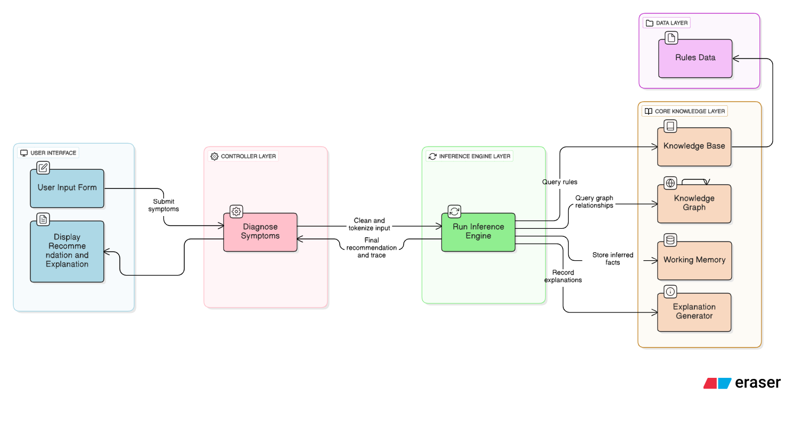

# 🏥 First Aid Knowledge-Based System

> An intelligent web-based diagnostic system using forward chaining inference to provide real-time first aid recommendations based on patient symptoms.

[](https://www.python.org/)
[](https://flask.palletsprojects.com/)
[](LICENSE)

---

## 📋 Overview

The First Aid KBS is a rule-based expert system that mimics medical decision-making by applying production rules to diagnose emergency conditions and recommend appropriate first aid actions. Built with a clean separation of concerns, the system uses **forward chaining** to derive conclusions from observed symptoms.

### System Architecture



### Inference Graph Visualization

.png)

*Visual representation of the forward chaining process showing how symptoms lead to diagnoses through rule evaluation*

---

## ✨ Key Features

- 🧠 **Forward Chaining Inference Engine** - Automated rule-based reasoning
- 📚 **Knowledge Base** - Extensible JSON-based production rules
- 💾 **Working Memory** - Dynamic fact storage and state management
- 💬 **Explanation Generation** - Human-readable diagnostic reasoning
- 🌐 **Modern Web Interface** - Intuitive symptom selection and result display
- 📊 **Inference Visualization** - Graph-based reasoning chain display
- ⚡ **Real-time Diagnosis** - Instant recommendations based on symptoms

---

## 🏗️ Architecture

### Layer Structure

```
┌─────────────────────────────────────────┐
│   🎨 Presentation Layer (HTML/CSS/JS)   │
├─────────────────────────────────────────┤
│   🌐 Application Layer (Flask Routes)   │
├─────────────────────────────────────────┤
│   🎮 Business Logic (Controller)        │
├─────────────────────────────────────────┤
│   🧠 Inference Engine (Forward Chain)   │
├─────────────────────────────────────────┤
│   💾 Knowledge & Memory (KB + WM)       │
├─────────────────────────────────────────┤
│   📊 Support Services (Explain + Graph) │
├─────────────────────────────────────────┤
│   💽 Data Layer (JSON Rules)            │
└─────────────────────────────────────────┘
```

### Project Structure

```
firstaid_kbs/
│
├── app/                      # Application layer
│   ├── __init__.py          # Flask app factory
│   ├── routes.py            # HTTP endpoints
│   ├── controller.py        # Business logic orchestrator
│   └── templates/
│       └── index.html       # Web interface
│
├── core/                     # Core inference engine
│   ├── engine.py            # Forward chaining algorithm
│   ├── knowledge_base.py    # Rule management
│   ├── working_memory.py    # Fact storage
│   ├── explanation.py       # Reasoning explanation
│   └── graph.py             # Inference visualization
│
├── data/
│   └── rules.json           # Production rules database
│
├── main.py                  # Application entry point
├── requirements.txt         # Python dependencies
└── README.md               # This file
```

---

## 🚀 Quick Start

### Prerequisites

- Python 3.8 or higher
- pip (Python package manager)

### Installation

1. **Clone the repository**
   ```bash
   git clone https://github.com/VenusCh001/firstaid_kbs.git
   cd firstaid_kbs
   ```

2. **Install dependencies**
   ```bash
   pip install -r requirements.txt
   ```

3. **Run the application**
   ```bash
   python main.py
   ```

4. **Open your browser**
   ```
   http://127.0.0.1:5000
   ```

---

## 💻 Usage

### Web Interface

1. **Select Symptoms** - Check one or more symptoms from the list
2. **Diagnose** - Click the "Diagnose" button to run inference
3. **View Results** - Review diagnosis, recommendations, and reasoning
4. **Reset** - Clear selections and start over

### Example Workflow

```
User Input: [chest_pain, difficulty_breathing]
    ↓
Forward Chaining Engine
    ↓
Rules Applied: heart_attack_rule
    ↓
Output: "Possible heart attack - Call 911 immediately, 
         have patient sit and rest, give aspirin if available"
```

---

## 🧠 How It Works

### Forward Chaining Process

1. **Initialize** - Load rules from knowledge base
2. **Add Facts** - User symptoms added to working memory
3. **Pattern Match** - Check which rules can fire
4. **Execute Rules** - Fire applicable rules and derive conclusions
5. **Iterate** - Repeat until no new facts can be derived
6. **Explain** - Generate human-readable reasoning
7. **Return** - Display diagnosis and recommendations

### Rule Format

Rules are defined in `data/rules.json`:

```json
{
  "name": "heart_attack_rule",
  "conditions": ["chest_pain", "difficulty_breathing"],
  "conclusion": "Possible heart attack - Call 911 immediately...",
  "priority": 10
}
```

**IF** conditions are met **THEN** conclusion is derived

---

## 📊 Supported Conditions

Current rule base covers:

- 🩸 **Bleeding** - Direct pressure, elevation
- 💔 **Heart Attack** - Emergency response, CPR
- 😮 **Choking** - Heimlich maneuver
- 😴 **Unconsciousness** - Responsiveness check, CPR
- 🔥 **Burns** - Cooling, sterile covering
- 🦴 **Fractures** - Immobilization, ice application
- 🌡️ **Fever** - Temperature monitoring, hydration
- 🤕 **Severe Headache** - Rest, medical attention

---

## 🔧 Extending the System

### Adding New Rules

1. Open `data/rules.json`
2. Add a new rule object:
   ```json
   {
     "name": "your_rule_name",
     "conditions": ["symptom1", "symptom2"],
     "conclusion": "Your diagnosis and recommendation",
     "priority": 8
   }
   ```
3. Save and restart the application


## 🛠️ Technology Stack

| Component | Technology |
|-----------|-----------|
| **Backend** | Python 3.8+, Flask 3.0 |
| **Frontend** | HTML5, CSS3, JavaScript (ES6+) |
| **Architecture** | Knowledge-Based Systems, Production Rules |
| **Algorithm** | Forward Chaining Inference |
| **Data Format** | JSON |
| **Design Pattern** | MVC, Layered Architecture |

---

## 👨‍💻 Author

**VenusCh001**
- GitHub: [@VenusCh001](https://github.com/VenusCh001)

---

## 🙏 Acknowledgments

- Built as part of Knowledge-Based Systems course (Semester 7)
- Inspired by expert system architectures in medical diagnosis
- Thanks to the Flask and Python communities

---


<div align="center">

**⚠️ Disclaimer**: This system is for educational purposes only. Always seek professional medical help in real emergencies.

Made with ❤️ for Knowledge-Based Systems

</div>